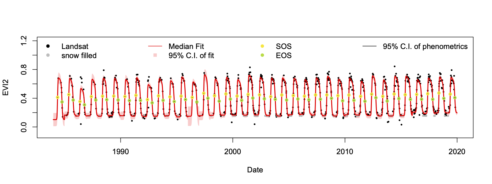
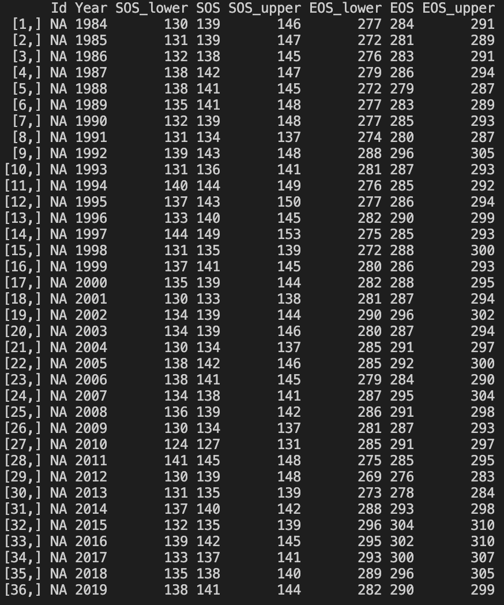

# Bayesian_LSP
A Bayesian hierarchical model that quantifies long-term annual land surface phenology from sparse 30 m Landsat time series (well, it doesn't have to be Landsat).

More details about the model please read the paper: xxxx. 

And the citation to this work is:
> Gao, X., Gray, J., Reich, B.(2021). Quantifying xxxx.

## Installation
The scripts are written in R programming language and use JAGS software to conduct the MCMC sampling for the Bayesian model. To run the scripts, users should install R along with some packages and JAGS. 

### R 
We use R v3.6.2. Although it should not be limited to this R version, but all of the scripts were tested under v3.6.2. 
Needed R packages are:
* data.table (most of the data in the scripts are processed by functions of data.table. Well, I like data.table!)
* rjags (for communicating with JAGS software)
* minpack.lm (it provides functions for non-linear least square fit)
* RColorBrewer (for plotting the result)
* viridis (for plotting the result)

### JAGS
We use JAGS v4.3.0. Again, it should not be limited to this JAGS version, but all of the scripts were tested under v4.3.0.
Users can download and install JAGS from this webpage. To use our scripts, there's no need to know how to use JAGS, actually after installation, users don't even need to open JAGS, we'll use R code to communitate with it.

## Run the model

There are 3 files in the respository's `Code` folder:
* base.R
* Bayesian_LSP_fit.R
* test_ts.Rds

`base.R` contains the needed libraries and pre-defined functions, it'll be sourced in `Bayesian_LSP_fit.R`, which runs the model.

`test_ts.Rds` is a cached R dataset file. It contains a Landsat EVI2 time series with columns including date and EVI2 value. Users can use the test data to quickly run the Bayesian model.

`Bayesian_LSP_fit.R` is easy to understand and run. The only thing need to do before running the script is changing the working directory specified in `setwd()` function, make sure the script can find the `base.R` file and `test_ts.Rds` file. After running the script, there will be a plot showing the result of LSP fit and a table that contains all retreived phenometrics. 

Detail information about the model can be found in the paper. 

Program result:

